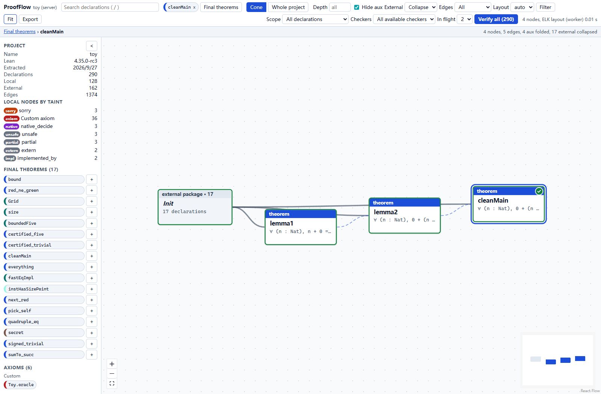
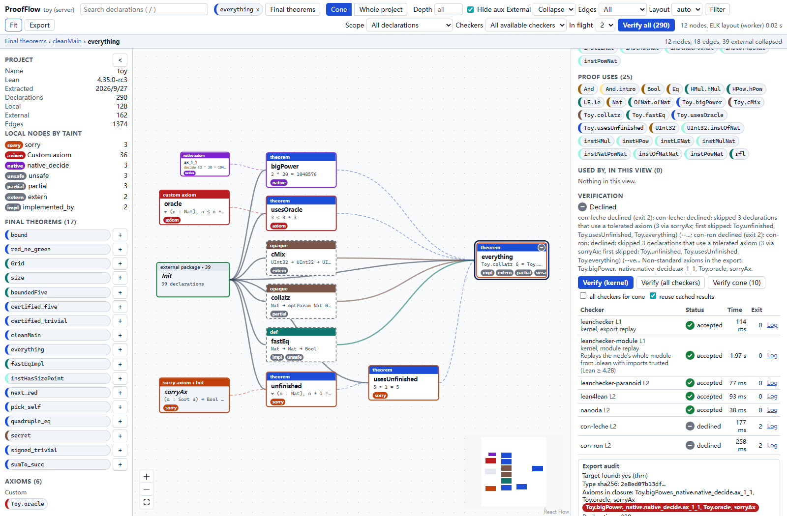

# ProofFlow

**See what a Lean theorem depends on. Inspect its assumptions. Replay its proof.**

A local viewer for Lean 4 projects, from axiom-to-theorem dependency maps to per-declaration kernel checks.

[Quick start](#quick-start) · [Large projects](#explore-large-projects) · [Verify all](#verify-a-node-a-cone-or-the-whole-graph) · [中文指南](#中文指南) · [Verification contract](docs/VERIFICATION.md)



*Live screenshot from [`examples/toy`](examples/toy). Verify all covers the loaded graph even when the canvas shows only one theorem's dependencies.*

ProofFlow reads a built Lean project and turns its declarations into a left-to-right workflow. Dependencies point toward the declarations that use them. Axioms form the sources; definitions and lemmas connect them to final theorems. Select a node to inspect its statement, source, dependencies, transitive axiom set, and checker results.

**Status:** early development. The current reference toolchain is Lean `4.35.0-rc3`, tested on Windows 11. The repository includes launchers for Windows and Unix-like shells, a small Lean fixture, and a Mathlib example.

## What you can do

| Task | In ProofFlow |
|---|---|
| Understand a proof's foundations | Trace statement and proof dependencies; inspect transitive axioms and trust flags. |
| Find unfinished or assumption-heavy proofs | Identify `sorry`, custom axioms, `native_decide`, and implementation-related flags. |
| Browse an entire project | Switch between the project map and a target's dependency cone; search declarations and zoom into details. |
| Check a declaration | Export its dependency closure and replay it through the available kernels. |
| Run a batch | Verify a cone or every declaration in the loaded graph, with progress and per-node outcomes. |
| Share a view | Export the displayed graph as JSON or SVG. Load a graph file for standalone inspection. |

ProofFlow reads compiled declarations; it does not edit Lean source or display tactic-by-tactic proof trees.

## Quick start

You need **Node.js 22+**, **pnpm 10+**, and **Lean with `lake` on PATH**, usually through elan. Use the toolchain specified by the project you want to inspect.

Clone and try the bundled example:

```bash
git clone https://github.com/Zhen-WushuiLingchun/lean_visualization.git
cd lean_visualization
pnpm install
pnpm build
pnpm proofflow extract --project examples/toy
pnpm proofflow serve --project examples/toy --open
```

The local viewer opens at **http://127.0.0.1:4870**. Extraction builds the Lean project before reading its compiled environment.

For your own project, run these commands from the ProofFlow repository:

```bash
pnpm proofflow extract --project "/path/to/lean/project"
pnpm proofflow serve --project "/path/to/lean/project" --open
```

On Windows, a quoted path such as `"D:/work/My Lean Project"` works too. Rebuild and re-extract after changing Lean source to refresh the graph.

<details>
<summary>One-click launchers and the Mathlib example</summary>

The launchers install JavaScript dependencies and build ProofFlow on the first run. With no project argument, they open the Toy example.

Windows PowerShell:

```powershell
.\proofflow.cmd
.\proofflow.cmd "D:/work/My Lean Project"
```

Linux, macOS, or Git Bash:

```bash
bash ./proofflow.sh
bash ./proofflow.sh /path/to/lean/project
```

After updating ProofFlow, run `pnpm install` and `pnpm build` again; the launchers do not rebuild existing bundles automatically.

To try [`examples/mathlib-demo`](examples/mathlib-demo), obtain its Mathlib cache first:

```bash
cd examples/mathlib-demo
lake exe cache get
cd ../..
pnpm proofflow extract --project examples/mathlib-demo
pnpm proofflow serve --project examples/mathlib-demo --open
```

</details>

## Explore large projects

Projects with more than 600 local declarations open in **Whole project** mode. The viewer keeps all declarations in the loaded file while varying how much detail it draws.

1. Start with the overview. **Hide aux** hides generated declarations; **External: Collapse** groups external declarations by package.
2. Search for a declaration to locate it on the project map. **Shift+Enter** opens its dependency cone.
3. Zoom in to see detailed cards. Use **Fit** or the minimap to navigate back.
4. To display every declaration already in the file, disable **Hide aux** and select **External: Expand**.
5. Dense views simplify edge drawing by default. Use **Show all edges** when needed; drawing is progressive and cancellable.

Layout work runs in a Web Worker. Large views use Canvas for the overview and a bounded number of detailed HTML cards. These display choices do not change extracted trust profiles or the dependency closures sent to verification.

**The graph file defines the browsing boundary.** By default, directly referenced external declarations are boundary nodes with `depsComplete: false`. Expanding a package in the viewer reveals those nodes; it does not fetch the rest of Mathlib. To extract external closures as well:

```bash
pnpm proofflow extract --project "/path/to/lean/project" --expand-external
```

This can substantially increase extraction time and graph size.

### Tested scale

One real research project on Windows 11 contained **12,896 declarations**: 9,212 local and 3,684 external, with **597,276 raw dependency edges**. The viewer displayed the full expanded graph without the previous 3,000-node layout limit.

| Browser observation | Recorded result |
|---|---:|
| First display of the default project map | 2.5–3.3 s |
| Switch to all 12,896 declarations | About 2.8 s |
| Optional full drawing of 601,995 indexed edges | About 4.0 s |
| Detailed HTML cards mounted at once | At most 80 |

Indexed edges include implied axiom edges, so their count can exceed the raw file count. These are single-machine observations, not performance guarantees. See [the benchmark procedure, memory boundaries, and regression checks](docs/PERFORMANCE.md). The research graph itself is not distributed in this repository.

## Verify a node, a cone, or the whole graph

Verification requires the local ProofFlow server and the audited project's toolchain. A standalone graph file supports inspection, but cannot run checkers.

| Control | Scope |
|---|---|
| **Verify (kernel)** | The selected declaration, using the available L1 checker(s). |
| **Verify (all checkers)** | The selected declaration, using all available checkers reported by the server. |
| **Verify cone** | Local declarations in the selected node's displayed dependency cone. |
| **Verify all (N)** | Every real declaration in the loaded graph file, including hidden auxiliary nodes and external nodes. |

For **Verify all**, select **Local declarations only** to restrict the batch to the project's own declarations, or **Kernel only** to limit the requested checkers. Scope is independent of canvas filters, zoom, depth limits, and collapsed packages.

Batch submission uses a rolling window, with **2 declarations in flight by default**. Choose 1 for lower resource usage or 4 to allow a few additional pending requests. The existing server runs at most 2 verification jobs concurrently by default; raising the browser limit does not raise that server limit. As a declaration completes, another enters the queue without waiting for slower declarations in the same group.

This reuses the per-declaration API rather than adding a bulk verification endpoint. It bounds pending work and overlaps verification jobs while preserving a separate export, cache check, and result for every declaration. Progress reports accepted, rejected, error, and incomplete counts. Stopping the queue prevents further submissions; already submitted jobs finish. Keep the page open while it runs. Starting again submits the chosen scope again, and the server can reuse valid cached work.

A green browser badge never skips a Verify all request. Export, toolchain, and checker-binary bindings still govern cache reuse. Large batches can take substantial time and disk space because each declaration is checked with its dependency closure; batch submission does not eliminate that work.



*`Toy.everything` deliberately uses non-standard assumptions. Some kernels accept its export; `con-leche` and `con-ron` decline. ProofFlow retains the grey dash and trust flags instead of presenting the result as fully accepted.*

### What a result means

| Level | Evidence | Boundary |
|---|---|---|
| **L0 · Trust profile** | Transitive axiom and trust-flag information extracted from the compiled environment. | Does not recheck the proof. |
| **L1 · Kernel replay** | Replays the exported closure with Lean's kernel in a fresh environment. | Shares Lean's kernel implementation. |
| **L2 · Additional checkers** | Checks the export with independent implementations and the official paranoid checker. | Each checker's result is separate; unavailable or declined checks are not acceptance. |

On the tested Lean `4.35.0-rc3` toolchain, export-based checks include `leanchecker`, `leanchecker-paranoid`, `lean4lean`, `nanoda`, `con-leche`, and `con-ron`. The UI discovers actual availability; it may also offer module replay. On older toolchains without `leanexport`, the fallback checks the declaration's **whole module with imports trusted**, a narrower guarantee than fresh closure replay.

A green verification badge requires an accepted L1 result and acceptance from every requested checker. It does **not** mean that the theorem has no `sorry`, that a custom axiom is consistent, or that the statement captures the intended mathematics. Trust flags remain visible independently of checker results.

Read the [verification contract](docs/VERIFICATION.md) for export audits, hashes, cache reuse, and limitations, and [checker notes](docs/CHECKERS.md) for the tested command lines.

You can also verify from the CLI:

```bash
pnpm proofflow verify Toy.cleanMain --project examples/toy --checkers all
pnpm proofflow checkers --project examples/toy
```

## 中文指南

**ProofFlow 用来回答：这个 Lean 定理依赖什么？用了哪些公理？重新交给内核检查，结果是什么？**

它将已构建的 Lean 工程显示为从左到右的依赖图：公理在起点，定义与引理居中，最终定理在末端。点击节点可以查看命题、源码、直接依赖、传递公理集合，以及每个检查器的独立结果。节点种类、信任标记和验证徽章分别表达不同信息。

**开始使用：**安装 Node.js 22+、pnpm 10+ 和 elan/Lean，在仓库根目录执行上面的 Quick start。Windows 也可以直接运行 `proofflow.cmd` 打开示例，或传入你的 Lean 项目路径。源码修改后需要重新提取图数据。

**查看大项目：**使用 **Whole project** 全项目地图，搜索定位节点，放大查看卡片，Shift+Enter 查看依赖锥。取消 **Hide aux** 并将 **External** 设为 **Expand**，即可显示图文件中已有的全部声明。显示折叠和连线简化仅影响绘制，不会降低后端验证要求。若要连外部库的完整依赖也一并提取，需要使用 `--expand-external`，数据量会相应增加。

**一键批量验证：**顶部 **Verify all (N)** 默认包含图文件中的全部真实声明，即使它们在画布上被隐藏或折叠。可选择仅本项目声明，以及全部可用检查器或仅内核。默认保留 2 个在途任务，完成一个便补入下一个；可选 1 或 4，服务器默认仍最多并发运行 2 个节点任务。停止后不再提交后续节点，已经提交的任务会正常结束。运行期间请保持页面打开。再次启动时，服务器会检查并复用仍然有效的缓存。

**严谨性边界：**“内核接受”不等于“没有 sorry”，也不等于“自定义公理一致”或“形式化命题符合原始数学意图”。检查器的拒绝、报错和不支持会分别显示；一个检查器接受不会代替另一个检查器的结果。请结合节点信任信息与 [验证说明](docs/VERIFICATION.md) 阅读结论。

## Development and documentation

```bash
pnpm build
pnpm test
pnpm dev:server serve --project examples/toy
# In another terminal:
pnpm dev:web
```

The Vite development server uses port `5173` and proxies `/api` to port `4870`. For real Lean integration tests in PowerShell:

```powershell
$env:PROOFFLOW_INTEGRATION = "1"
pnpm --filter @proofflow/server test
```

| Path | Purpose |
|---|---|
| [`lean/`](lean) | Extractor and axiom cross-check scripts. |
| [`packages/schema/`](packages/schema) | Shared graph and verification contracts. |
| [`packages/server/`](packages/server) | Local API, CLI, extraction, checker orchestration, and caching. |
| [`packages/web/`](packages/web) | React viewer, graph layout, search, and verification controls. |
| [`examples/toy/`](examples/toy) | Small fixture covering clean proofs and trust cases. |
| [`docs/ARCHITECTURE.md`](docs/ARCHITECTURE.md) | Data flow, API, rendering, and scale strategy. |
| [`docs/SURVEY.md`](docs/SURVEY.md) | Related tools and the project's scope. |
| [`AGENTS.md`](AGENTS.md) | Development contracts and release checks. |

## License

[MIT](LICENSE).
